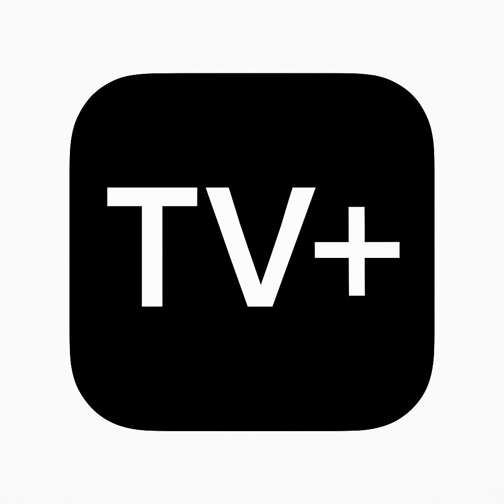
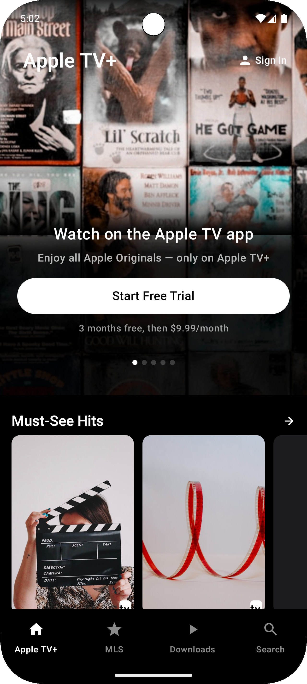
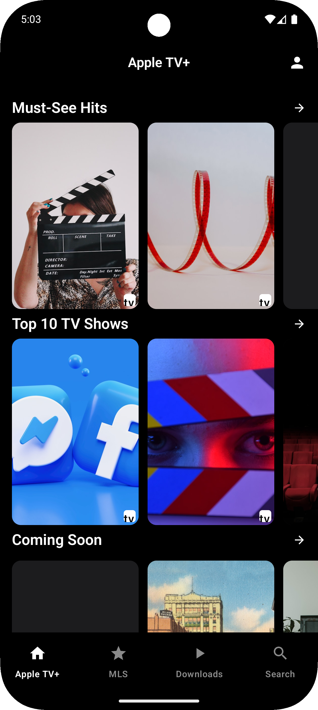

# AppleUI Android Application

An Android application that implements Apple-inspired UI design elements for Android.

## Project Overview

This project demonstrates how to create iOS-like UI components in an Android application, implementing Apple's design language while maintaining Android development best practices.

## Features

- iOS-inspired design elements
- Smooth animations and transitions
- Implementation of Apple design patterns
- Android compatibility

## Technology Stack

- Kotlin/Java
- Android Studio
- Jetpack Compose (if applicable)

## Getting Started

1. Clone this repository
2. Open the project in Android Studio
3. Build and run the application on an Android device or emulator

## License

This project is for educational purposes only.

 

<h1 align="center">Apple TV+ UI</h1>
 

  </a>
  </a>
  </a>
  </a>
   
   

## Key Features 🔥

1. **Edge-to-Edge Design**: Full immersive experience with dynamic status bar transparency and system inset handling
2. **Hero Section**: Beautiful hero carousel with animated transitions and Apple TV+ style dot indicators
3. **Call-to-Action Section**: Clean, minimal CTA section with subscription details and trial button
4. **Content Carousels**: Horizontal scrolling content sections for Movies, TV Shows and other categories
5. **Animated TopAppBar**: The top app bar appears and disappears based on scroll position

## Screenshots 📸

<table>
  <tr>
    <td valign="top"></td>
    <td valign="top"></td>
  </tr>
</table>

## Implementation Details

This project implements the Apple TV+ landing screen using Kotlin and Jetpack Compose with modern Material 3 APIs:

- **Compose BOM 2025.05**: Latest Compose libraries and components
- **Material 3**: For a consistent and modern UI
- **Coil 3**: For efficient image loading and caching
- **Edge-to-Edge**: Full integration with system insets for a seamless experience
- **SF Pro Display Font**: Using Apple's typography for authentic look and feel